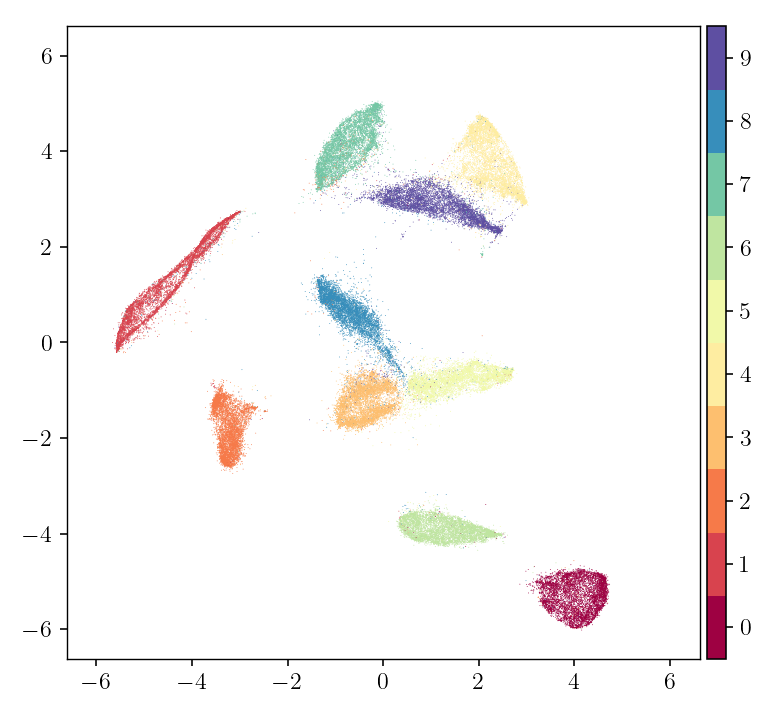

.. pymde documentation master file, created by
   sphinx-quickstart on Fri Feb  5 14:25:21 2021.
   You can adapt this file completely to your liking, but it should at least
   contain the root `toctree` directive.

PyMDE: Minimum-Distortion Embedding
====================================

PyMDE is a Python library for computing vector embeddings of items, such as
images, biological cells, nodes in a network, or any other type of abstract
object. The embeddings are designed to minimally distort relationships between
pairs of items, while possibly satisfying some constraints.

PyMDE can be used to:

* visualize datasets, small or large;
* generate feature vectors for supervised learning;
* compress high-dimensional vector data;
* draw graphs;
* and more.

Here's an example that shows how to use PyMDE to visualize high-dimensional
vectors (which in this case are images from the MNIST dataset).

.. code:: python3

	import pymde

	mnist = pymde.datasets.MNIST()
	embedding = pymde.preserve_neighbors(mnist.data, verbose=True).embed()
	pymde.plot(embedding, color_by=mnist.attributes['digits'])

Each point represents an image in the dataset, and every point is colored
by the digit represented by its underlying image. However, only the raw
pixel data was used to create the embedding.

This is just one of the many things that PyMDE can do.

Why use PyMDE?
~~~~~~~~~~~~~~

There are many reasons to try out PyMDE. Here are some.

**PyMDE is expressive.**
PyMDE is based on a simple but general framework for embedding, called
*Minimum-Distortion Embedding* (MDE). The MDE framework generalizes well-known
methods like PCA, spectral embedding, multi-dimensional scaling, LargeVis, and
UMAP. With (Py)MDE, it is easy to recreate well-known embeddings and to create
new ones, tailored to your particular application. Unlike most other methods
for creating embeddings, PyMDE also lets you impose constraints on the
embedding.

For example, the below GIFs show PyMDE computing three different
kinds of embeddings of the MNIST data.

.. image:: files/mnist_quadratic.gif
	:width: 32 %
.. image:: files/mnist_centered.gif
	:width: 32 %
.. image:: files/mnist_std.gif
	:width: 32 %

The MDE framework was introduced in the paper
`Minimum-Distortion Embedding <https://web.stanford.edu/~boyd/papers/min_dist_emb.html>`_,
and PyMDE is its official implementation.

**PyMDE is easy to use.**
It's very easy to get started with PyMDE. You can just call a high-level
function to embed your data (be they high-dimensional vectors or the nodes in a
graph), into any target dimension, using just one line of code. Creating
custom embeddings is also easy, because PyMDE separates the description of an
embedding from how it is computed: you say what kind of embedding you want, and
PyMDE will compute it for you.

In addition to computing embeddings, PyMDE can plot them (if
the embedding dimension is three or less), create GIFs of the embedding
process, help you compare different embeddings, preprocess your data, and
more.

**PyMDE is principled.**
The MDE framework provides principled methods to debug and analyze
embeddings. These methods can be used to make your embeddings more faithful
to your original data, and to search for anomalies and outliers in the original
data.

**PyMDE is fast.**
PyMDE is competitive in runtime with more specialized embedding methods, and
can scale to datasets with millions of items. With a GPU, it can be even
faster.

.. toctree::
	:hidden:
	:maxdepth: 2
	:caption: CONTENTS

	installation/index
	getting_started/index
	mde/index
	preserve_neighbors/index
	preserve_distances/index
	visualizing/index
	incremental/index
	datasets/index
	examples/index
	api/index
	citing/index
